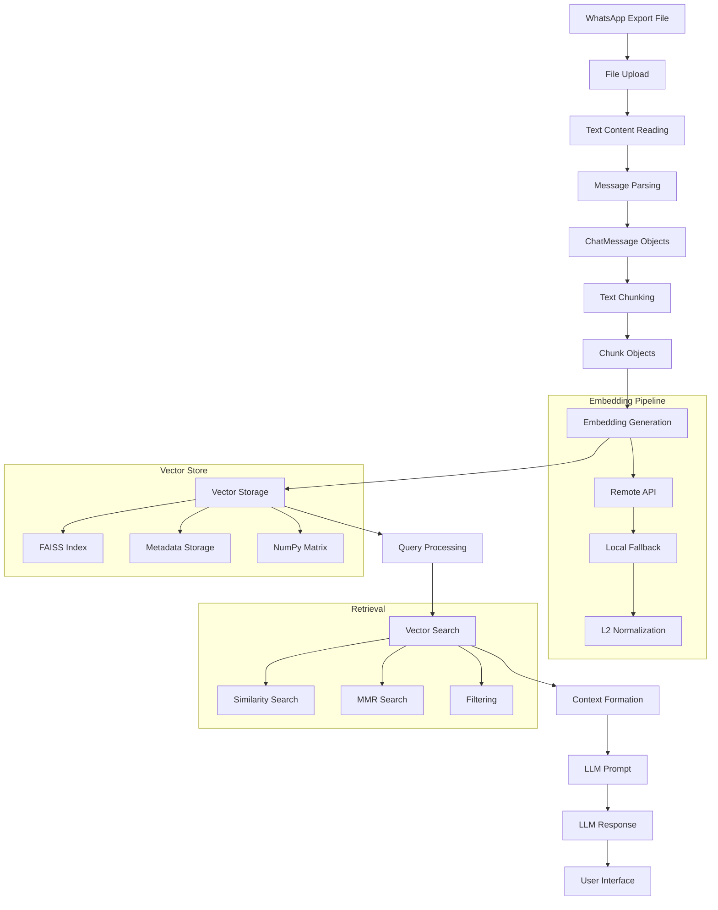
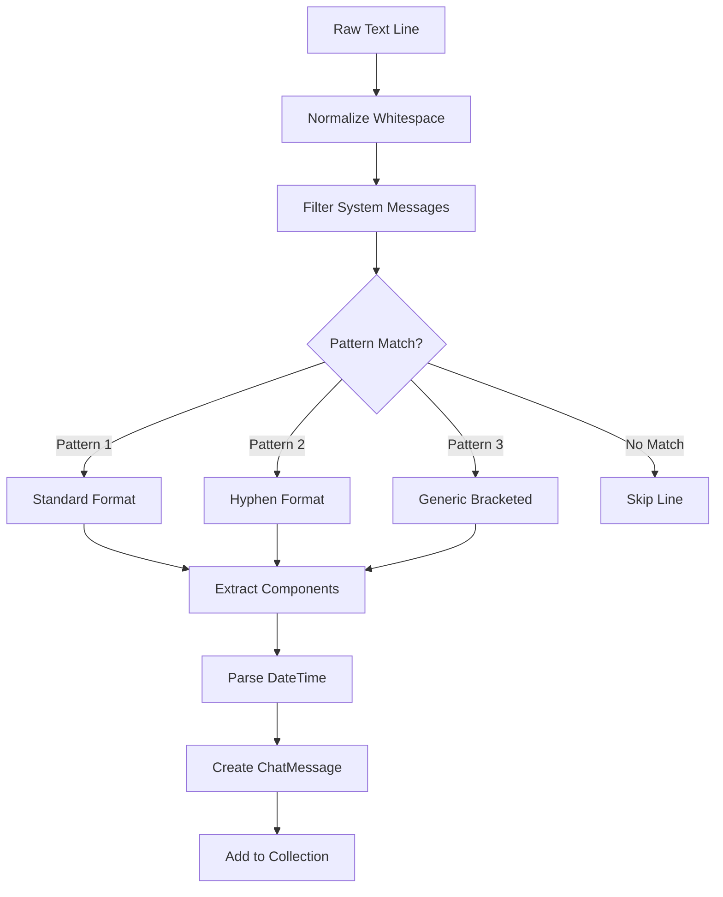
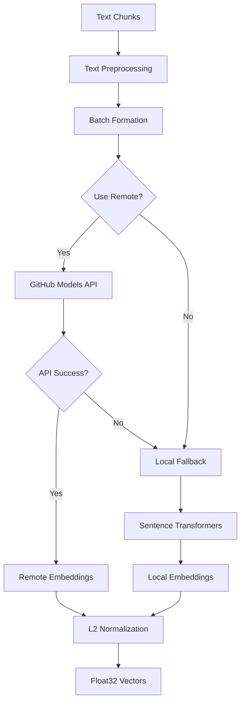

# WhatsApp RAG Architecture Documentation

## Overview

This document provides a comprehensive overview of the WhatsApp RAG (Retrieval-Augmented Generation) system architecture, detailing the complete pipeline flow from WhatsApp message parsing through vector storage and LLM response generation.

## Table of Contents

- [Architecture Overview](#architecture-overview)
- [Pipeline Flow](#pipeline-flow)
- [Component Deep Dive](#component-deep-dive)
- [Data Flow Diagrams](#data-flow-diagrams)
- [Design Decisions](#design-decisions)
- [Integration Patterns](#integration-patterns)
- [Performance Considerations](#performance-considerations)

## Architecture Overview

The WhatsApp RAG system is built as a modular Python application using a layered architecture:

```
┌─────────────────────────────────────────────────────────┐
│                    Presentation Layer                   │
│                    (Gradio Web UI)                      │
├─────────────────────────────────────────────────────────┤
│                  Application Layer                      │
│                 (RAGPipeline + State)                   │
├─────────────────────────────────────────────────────────┤
│                    Service Layer                        │
│      ┌──────────────┬──────────────┬─────────────────┐   │
│      │   Parser     │  Embeddings  │   Vector Store  │   │
│      │   (core.py)  │(embeddings.py)│(vector_store.py)│   │
│      └──────────────┴──────────────┴─────────────────┘   │
├─────────────────────────────────────────────────────────┤
│                   Infrastructure Layer                  │
│     ┌────────────┬────────────────┬─────────────────┐    │
│     │   FAISS    │ Sentence Trans │   GitHub API    │    │
│     │  (Vector   │   (Local Emb)  │   (Remote LLM)  │    │
│     │ Indexing)  │                │                 │    │
│     └────────────┴────────────────┴─────────────────┘    │
└─────────────────────────────────────────────────────────┘
```

## Pipeline Flow

### 1. Data Ingestion

The pipeline begins when a user uploads a WhatsApp export text file through the Gradio interface:

```
WhatsApp Export (.txt) → File Upload → Content Reading → Parsing
```

### 2. Message Parsing

The `parse_whatsapp_txt()` function in `core.py` processes raw text using multiple regex patterns:

**Pattern Matching Strategy:**
- **Primary Pattern**: `[DD/MM/YYYY, HH:MM] Sender: Message`
- **Alternative Pattern**: `DD/MM/YYYY, HH:MM - Sender: Message`
- **Generic Pattern**: Flexible bracketed format with AM/PM support

**Parsing Logic Flow:**
```python
Raw Text Lines
    ↓
Line Normalization (whitespace, invisible chars)
    ↓
System Message Filtering
    ↓
Pattern Matching (3 regex patterns)
    ↓
DateTime Parsing & Normalization
    ↓
ChatMessage Objects
```

**Key Parsing Features:**
- Handles multiple WhatsApp export formats
- Normalizes Unicode whitespace characters (`\u00A0`, `\u202F`, `\u2009`)
- Filters system messages ("encrypted", "omitted", "deleted")
- Supports both 12h and 24h time formats
- Date normalization for 2-digit years (20XX assumption)

### 3. Text Chunking

The `chunk_messages()` function implements a sliding window approach:

**Chunking Parameters:**
- `window_size`: 30 messages per chunk (default)
- `window_overlap`: 10 messages overlap between chunks
- Rationale: Maintains conversation context while preventing information loss

**Chunking Process:**
```
Message List
    ↓
Sliding Window (size=30, overlap=10)
    ↓
Text Window Generation
    ↓
Metadata Extraction
    ↓
Chunk Objects with IDs
```

**Chunk Structure:**
```python
@dataclass
class Chunk:
    chunk_id: str              # SHA1 hash-based ID
    chat_id: str               # Source chat identifier
    start_ts: datetime         # First message timestamp
    end_ts: datetime          # Last message timestamp
    participants: List[str]    # Unique senders in chunk
    line_span: Tuple[int, int] # Source line numbers
    text_window: str          # Formatted message text
```

### 4. Embedding Generation

The `EmbeddingProvider` class implements a dual embedding approach:

**Primary: Remote API Embeddings**
- **Provider**: GitHub Models API (OpenAI-compatible)
- **Model**: `openai/text-embedding-3-small` (default)
- **Features**: High-quality multilingual embeddings
- **Batching**: Smart batching with configurable limits

**Secondary: Local Fallback**
- **Model**: `intfloat/multilingual-e5-small`
- **Provider**: Sentence Transformers
- **Use Case**: When remote API is unavailable or disabled

**Embedding Pipeline:**
```
Text Chunks
    ↓
Text Truncation (4000 chars max per item)
    ↓
Batch Formation (64 items, 60K chars max per batch)
    ↓
Remote API Call → [Success] → Vector Embeddings
    ↓ [Failure]
Local Model Fallback
    ↓
L2 Normalization
    ↓
Float32 Vectors
```

**Batching Strategy:**
- Maximum 64 texts per API request
- Maximum 60,000 characters per request payload
- Individual text truncation at 4,000 characters
- Prevents 413 Payload Too Large errors

### 5. Vector Storage

The `InMemoryFAISS` class provides vector storage with optional FAISS acceleration:

**Storage Architecture:**
```
┌─────────────────────────────────────────┐
│            InMemoryFAISS                │
├─────────────────────────────────────────┤
│  FAISS Index          │  Python Arrays  │
│  (IndexFlatIP)        │  - ids[]         │
│  - Fast similarity    │  - metadatas[]   │
│  - Optimized search   │  - _matrix       │
└─────────────────────────────────────────┘
```

**Dual Storage Strategy:**
1. **FAISS Index**: Optimized similarity search when available
2. **NumPy Matrix**: Fallback implementation + required for MMR/filtering
3. **Metadata Arrays**: Parallel storage for chunk information

**Vector Operations:**
- **Similarity**: Cosine similarity via L2-normalized dot products
- **Search**: FAISS IndexFlatIP or NumPy argpartition
- **Normalization**: L2 normalization ensures cosine similarity

### 6. Retrieval Methods

Two retrieval strategies are implemented:

**Standard Similarity Search:**
```
Query Embedding
    ↓
Cosine Similarity Calculation
    ↓
Top-K Selection
    ↓
Metadata Retrieval
```

**MMR (Maximal Marginal Relevance) Search:**
```
Query Embedding
    ↓
Initial Similarity Calculation
    ↓
Pre-filtering (fetch_k candidates)
    ↓
MMR Iteration:
  - Relevance Score (λ * similarity_to_query)
  - Diversity Score ((1-λ) * max_similarity_to_selected)
  - Select best balance
    ↓
Diversified Top-K Results
```

**MMR Formula:**
```
MMR(d) = λ * Sim(d, query) - (1-λ) * max[Sim(d, s) for s in selected]
```

**Filtering Capabilities:**
- **Sender Filtering**: Match messages by participant names
- **Date Range Filtering**: ISO timestamp-based date filtering
- **Combined Filtering**: Multiple filter types simultaneously

### 7. Context Generation

The retrieved chunks are processed for LLM consumption:

```
Retrieved Chunks
    ↓
Text Window Extraction (first 5 lines per chunk)
    ↓
Context Concatenation
    ↓
Prompt Template Application
    ↓
Final LLM Prompt
```

**Prompt Structure:**
```
System Prompt: Role definition + constraints
User Prompt:
  - Context: Retrieved chat snippets
  - Question: User query
  - Instructions: Citation requirements
```

### 8. LLM Integration

The system integrates with GitHub Models API for response generation:

```
Context + Query
    ↓
Prompt Construction
    ↓
OpenAI Client (GitHub Models)
    ↓
Chat Completion API
    ↓
Response Processing
    ↓
Spanish Language Response
```

## Data Flow Diagrams

### Overall System Data Flow



### Message Parsing Flow



### Embedding Provider Flow



## Design Decisions

### 1. FAISS Implementation Choice

**Decision**: Use FAISS IndexFlatIP with NumPy fallback

**Rationale**:
- **Performance**: FAISS provides optimized similarity search for large datasets
- **Compatibility**: NumPy fallback ensures functionality without additional dependencies
- **Cosine Similarity**: IndexFlatIP with L2-normalized vectors efficiently computes cosine similarity
- **Memory Efficiency**: In-memory storage suitable for typical WhatsApp chat sizes

**Trade-offs**:
- **Memory Usage**: Keeps full vector matrix in memory
- **Disk Persistence**: Simple JSON/NumPy serialization over FAISS-specific formats
- **Scalability**: Limited to memory capacity but sufficient for chat-scale data

### 2. Dual Embedding Approach

**Decision**: Remote API primary with local fallback

**Rationale**:
- **Quality**: Remote models (text-embedding-3-small) provide superior embeddings
- **Reliability**: Local fallback ensures system availability
- **Language Support**: Both models support multilingual/Spanish content
- **Cost Control**: Batching reduces API costs

**Implementation Benefits**:
- Graceful degradation when API is unavailable
- Consistent embedding dimensions across providers
- Configurable switching between modes

### 3. Sliding Window Chunking

**Decision**: 30-message windows with 10-message overlap

**Rationale**:
- **Context Preservation**: Maintains conversation flow across chunks
- **Information Retention**: Overlap prevents context loss at boundaries
- **Size Balance**: Large enough for context, small enough for focused retrieval
- **Conversation Coherence**: Multiple speakers per chunk provide dialog context

### 4. MMR Implementation

**Decision**: Custom MMR with pre-filtering and configurable parameters

**Rationale**:
- **Diversity**: Reduces redundant similar chunks in results
- **Relevance Balance**: λ parameter allows tuning relevance vs. diversity
- **Filtering Integration**: Works with sender and date filters
- **Performance**: Pre-filtering with fetch_k limits computation

### 5. Message Parsing Strategy

**Decision**: Multiple regex patterns with robust fallbacks

**Rationale**:
- **Format Diversity**: WhatsApp exports vary across platforms/versions
- **Error Tolerance**: Continues processing when some messages fail to parse
- **Time Handling**: Supports both 12h/24h formats with AM/PM detection
- **Internationalization**: Handles Spanish AM/PM indicators ("a.m.", "p.m.")

## Integration Patterns

### 1. Provider Pattern (Embeddings)

The `EmbeddingProvider` class implements a provider pattern for embedding generation:

```python
class EmbeddingProvider:
    def embed_texts(self, texts: List[str]) -> np.ndarray:
        # Try remote first, fallback to local
        if not self.use_local_fallback and self._remote_token:
            try:
                return self._embed_remote(texts)
            except Exception:
                logger.warning("Remote failed, using local fallback")
        return self._embed_local(texts)
```

**Benefits**:
- Transparent switching between providers
- Consistent interface regardless of underlying implementation
- Easy testing and mocking

### 2. Strategy Pattern (Search)

Vector search implements strategy pattern with multiple algorithms:

```python
def retrieve(self, query: str, use_mmr: bool = True, **kwargs):
    if use_mmr:
        return self.vector_store.search_mmr(query_emb, **kwargs)
    else:
        return self.vector_store.search(query_emb, **kwargs)
```

**Benefits**:
- Runtime algorithm selection
- Easy addition of new search strategies
- A/B testing of retrieval methods

### 3. Pipeline Pattern (RAG)

The main RAG workflow follows a pipeline pattern:

```python
class RAGPipeline:
    def index_messages(self, messages):
        chunks = chunk_messages(messages)         # Stage 1
        texts = [c.text_window for c in chunks]   # Stage 2
        embeddings = self.embedder.embed_texts(texts)  # Stage 3
        self.vector_store.add(ids, embeddings, metas)  # Stage 4
```

**Benefits**:
- Clear separation of concerns
- Easy testing of individual stages
- Extensible processing pipeline

### 4. State Management Pattern

Application state is centralized in a singleton-like pattern:

```python
class AppState:
    def __init__(self):
        self.pipeline: Optional[RAGPipeline] = None
        self.chat_history: List[Tuple[str, str]] = []
        self.loaded_text: Optional[str] = None

STATE = AppState()  # Global state instance
```

**Benefits**:
- Centralized state management
- Easy state clearing and reset
- Shared state across UI components

### 5. Factory Pattern (Vector Store)

Vector store creation uses factory-like initialization:

```python
def __init__(self, dim: int):
    if HAS_FAISS:
        self.index = faiss.IndexFlatIP(dim)
    else:
        self.index = None
    # Fallback always available
    self._matrix: Optional[np.ndarray] = None
```

**Benefits**:
- Runtime dependency detection
- Graceful fallback when dependencies unavailable
- Consistent interface regardless of backend

## Performance Considerations

### 1. Memory Management

**Vector Storage**:
- Embeddings stored as float32 for memory efficiency
- L2 normalization computed once and cached
- Metadata kept separate from vectors for flexible querying

**Chunking Strategy**:
- Fixed-size chunks prevent memory spikes
- Overlap computed efficiently without duplication

### 2. Batching Strategy

**Embedding Generation**:
- Smart batching prevents API payload limits
- Character counting avoids request failures
- Concurrent batching possible for large datasets

**Search Operations**:
- FAISS provides O(log n) search performance
- NumPy fallback uses argpartition for O(n) performance
- MMR pre-filtering reduces computation complexity

### 3. Caching and Persistence

**Current Implementation**:
- In-memory storage for active sessions
- Optional persistence via save/load methods
- No query result caching (stateless retrieval)

**Future Optimizations**:
- Query result caching for repeated searches
- Incremental indexing for large chat updates
- Disk-based vector storage for very large datasets

### 4. Scalability Limits

**Current Capacity**:
- Memory-bound vector storage
- Single-process architecture
- Suitable for individual chat exports (<100K messages)

**Scaling Considerations**:
- Distributed vector storage for enterprise scale
- Async processing for large file uploads
- Database persistence for multi-user scenarios

---

This architecture provides a robust, extensible foundation for WhatsApp chat analysis with strong multilingual support, multiple fallback strategies, and clear separation of concerns across the processing pipeline.